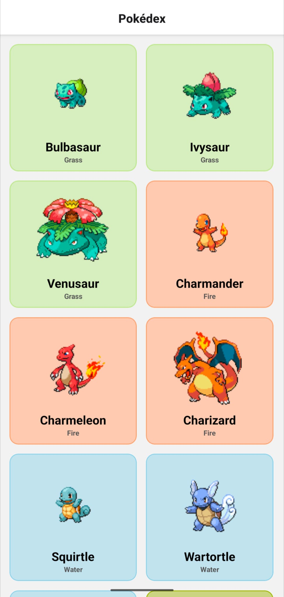
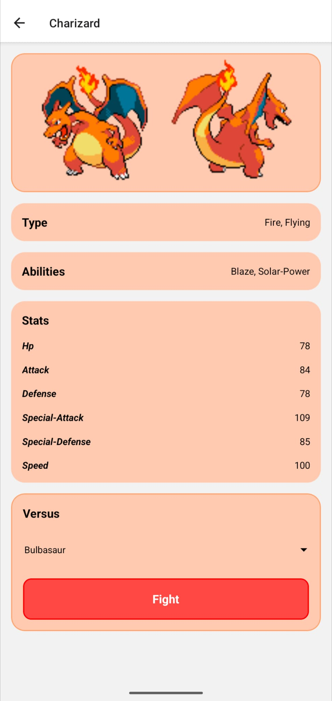
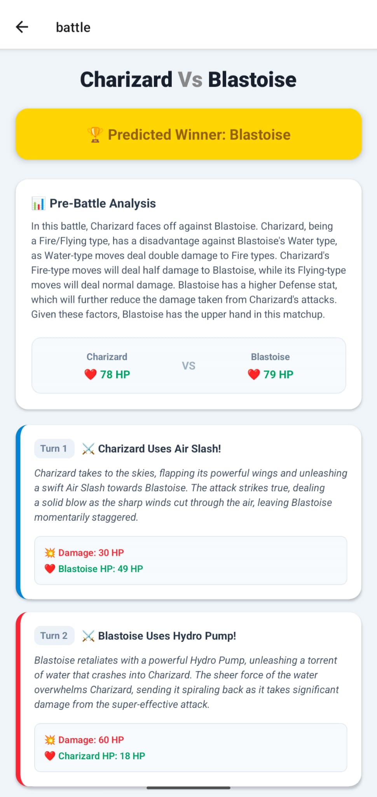

# pkdex
A mobile application that provides detailed Pokémon information and battle analysis.

The Battle Analyzer microservice integrates with the PokeAPI GraphQL endpoint to fetch true type-damage relations and base stats. It then uses LangChain and OpenAI to simulate objective, turn-by-turn battle sequences avoiding protagonist biases, all elegantly rendered onto an animated React Native timeline.

## Screenshots
<div style="display: flex; flex-direction: row; gap: 10px;">
  
  
  
</div>

## Get started

1. Install dependencies

   ```bash
   bun install
   ```

2. Start the app

   ```bash
   bun expo start
   ```
   ```
   bun expo start --tunnel
   ```

## Backend Setup (Battle Analyzer)

The backend microservice uses Python and FastAPI to simulate battles via OpenAI.

1. Navigate to the analyzer directory

   ```bash
   cd analyzer
   ```

2. Create a virtual environment and install dependencies

   ```bash
   python -m venv venv
   source venv/bin/activate
   pip install -r requirements.txt
   ```

3. Set up environment variables
   Create an `.env` file in the `analyzer/` directory to store your API key:
   ```env
   OPENAI_API_KEY=your_openai_key_here
   ```
   *Note: Ensure your React Native frontend `.env` in the root folder contains your local IP address (e.g., `EXPO_PUBLIC_IP_ADDRESS=192.168.x.x`) to connect to the backend.*

4. Start the backend server

   ```bash
   uvicorn main:app --reload --host 0.0.0.0 --port 8000
   ```
